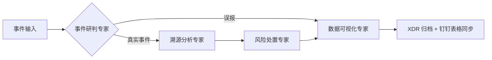

# XSOC 智能安全运营智能体系统 - CLAUDE.md

## 项目概述

基于火山引擎 VEADK 框架开发的安全运营多智能体系统，实现安全事件的自动化研判、溯源、处置和归档全流程闭环，替代人工完成 80% 以上的常规安全运营工作。

## VEADK 框架核心特性

VEADK（Volcengine Agent Development Kit）是火山引擎推出的企业级 AI 智能体应用开发框架，提供以下核心能力：

- **与 Google ADK 完全兼容**：支持现有项目无缝迁移
- **完善的记忆与知识库**：短期记忆（MySQL）、长期记忆（Viking DB/云搜索）、知识库（LlamaIndex）
- **内置丰富工具**：Web Search/图片生成/视频生成/代码沙箱等火山引擎生态工具
- **可观测性**：APMPlus、TLS、Tracing 追踪等
- **云原生部署**：VeFaaS、API 网关、CloudEngine 一键部署
- **企业级安全**：IAM 授权、凭据托管、细粒度权限控制

## 项目对齐内容

## 项目对齐与更新内容

### 📚 API 文档对齐

**api_docs 目录已更新为 JSON 格式接口文档，覆盖三大平台：**

#### 1. XDR 平台（扩展检测与响应）
- 路径：`docs&data_demo/api_docs/XDR/XDR_openapi_specs/`
- 接口数量：60+ 个
- 功能模块：
  - 告警信息查询
  - 告警统计查询
  - 事件信息查询
  - 事件统计查询
  - 威胁情报查询
  - 告警举证查询
  - 风险资产查询
  - 处置操作
  - 白名单管理
  - 其他查询

#### 2. NDR 平台（网络检测与响应）
- 路径：`docs&data_demo/api_docs/NDR/`
- 接口数量：80+ 个
- 功能模块：
  - 安全态势查询
  - 威胁信息查询
  - 资产信息查询
  - 风险信息查询
  - 调查分析
  - 处置封禁
  - 系统配置
  - MDR 服务

#### 3. Corplink 平台（企业链接）
- 路径：`docs&data_demo/api_docs/corplink/`
- 接口数量：40+ 个
- 功能模块：
  - 资产信息查询
  - 安全告警查询

### 🔧 API 文档格式说明

所有接口文档已转换为标准 OpenAPI 3.0.3 JSON 格式，包含：
- **接口基本信息**：标题、版本、描述、服务器地址
- **认证方式**：Bearer Token、API Key 等
- **请求参数**：路径参数、查询参数、请求体
- **响应格式**：成功/失败响应的详细结构
- **字段说明**：每个字段的类型、格式、描述

## 工具体系设计

### VEADK 内置工具优先原则

**注意**：VEADK 已提供丰富的内置工具，开发时应优先使用，避免重复开发。

#### VEADK 内置工具列表

| 工具名称         | 功能说明                                                                 | 导入路径                                  |
|----------------|--------------------------------------------------------------------------|---------------------------------------|
| `web_search`   | 火山引擎融合信息搜索 API，提供公域数据搜索功能                               | `veadk.tools.builtin_tools.web_search` |
| `vesearch`     | 火山引擎联网问答 Agent，支持头条搜索等                                      | `veadk.tools.builtin_tools.vesearch`   |
| `run_code`     | AgentKit 沙箱工具，支持代码执行                                           | `veadk.tools.builtin_tools.run_code`   |
| `image_generate` | 火山引擎图像生成工具                                                       | `veadk.tools.builtin_tools.image_generate` |
| `image_edit`   | 火山引擎图像编辑工具（图生图）                                               | `veadk.tools.builtin_tools.image_edit` |
| `video_generate` | 火山引擎视频生成工具                                                     | `veadk.tools.builtin_tools.video_generate` |
| `lark`         | 飞书 MCP 工具，实现文档处理、会话管理等                                     | `veadk.tools.builtin_tools.lark`       |
| `las`          | 火山引擎 AI 数据湖 LAS 工具，提供多模态数据集管理                            | `veadk.tools.builtin_tools.las`        |
| `vod`          | 火山引擎视频云 MCP 工具，支持视频剪辑处理                                     | `veadk.tools.builtin_tools.vod`        |

#### 工具架构设计：按意图分类的工具集

**架构思路**：按意图和动作设计 3-6 个工具，每个工具融合多个平台的接口，通过适配器统一处理不同格式的响应。

```python
# 风险事件查询工具（包含 XDR/NDR 平台）
def risk_query(
    asset_ip: str,       # 目标资产IP
    time_range: str = "24h",  # 时间范围
    platform: str = "xdr",  # 平台选择
    tool_context: ToolContext,
) -> dict:
    """风险事件查询工具（XDR/NDR 平台融合）"""

    if platform == "xdr":
        # XDR 平台接口调用
        return xdr_risk_query(asset_ip, time_range, tool_context)
    elif platform == "ndr":
        # NDR 平台接口调用
        return ndr_risk_query(asset_ip, time_range, tool_context)
    else:
        # 跨平台综合查询
        xdr_result = xdr_risk_query(asset_ip, time_range, tool_context)
        ndr_result = ndr_risk_query(asset_ip, time_range, tool_context)
        return merge_risk_results(xdr_result, ndr_result)

# 资产信息查询工具（包含 XDR/NDR/Corplink 平台）
def asset_query(
    asset_ip: str,
    platform: str = "xdr",
    tool_context: ToolContext,
) -> dict:
    """资产信息查询工具"""

    if platform == "xdr":
        return xdr_asset_query(asset_ip, tool_context)
    elif platform == "ndr":
        return ndr_asset_query(asset_ip, tool_context)
    elif platform == "corplink":
        return corplink_asset_query(asset_ip, tool_context)
    else:
        # 跨平台资产信息合并
        return merge_asset_info(
            xdr_asset_query(asset_ip, tool_context),
            corplink_asset_query(asset_ip, tool_context),
        )

# 处置封禁工具（包含 XDR/NDR 平台）
def block_action(
    block_type: str,      # block/whitelist/quarantine
    target: dict,         # 目标信息
    duration: int = 3600,  # 生效时长
    platform: str = "xdr",
    tool_context: ToolContext,
) -> dict:
    """处置封禁工具"""

    if platform == "xdr":
        return xdr_block_action(block_type, target, duration, tool_context)
    elif platform == "ndr":
        return ndr_block_action(block_type, target, duration, tool_context)

    return {"status": "error", "message": "Unsupported platform"}

# XDR 平台适配器实现
def xdr_risk_query(asset_ip: str, time_range: str, tool_context: ToolContext) -> dict:
    """XDR 风险查询接口"""
    return {"risk_level": "高危", "events": 5}

def xdr_asset_query(asset_ip: str, tool_context: ToolContext) -> dict:
    """XDR 资产查询接口"""
    return {"hostname": "server-001", "os": "Windows Server"}

# NDR 平台适配器实现
def ndr_risk_query(asset_ip: str, time_range: str, tool_context: ToolContext) -> dict:
    """NDR 风险查询接口"""
    return {"score": 85, "vulnerabilities": ["CVE-2024-xxxx"]}

def ndr_asset_query(asset_ip: str, tool_context: ToolContext) -> dict:
    """NDR 资产查询接口"""
    return {"asset_name": "web-server-01", "service": ["HTTP", "HTTPS"]}

# Corplink 平台适配器实现
def corplink_asset_query(asset_ip: str, tool_context: ToolContext) -> dict:
    """Corplink 资产查询接口"""
    return {"asset_id": "12345", "owner": "john.doe@company.com"}
```

### 完整的工具集设计（6个工具）

#### 1. 资产信息查询工具
```python
def asset_query(
    asset_ip: str,
    platform: str = "xdr",  # 支持 xdr/ndr/corplink/all
    tool_context: ToolContext,
) -> dict:
    """资产信息查询工具"""
    results = []
    if platform in ["xdr", "all"]:
        results.append(xdr_asset_query(asset_ip))
    if platform in ["ndr", "all"]:
        results.append(ndr_asset_query(asset_ip))
    if platform in ["corplink", "all"]:
        results.append(corplink_asset_query(asset_ip))
    return merge_asset_info(results)

def merge_asset_info(asset_results):
    """合并跨平台资产信息"""
    merged = {}
    for result in asset_results:
        for key, value in result.items():
            if key not in merged:
                merged[key] = value
            elif isinstance(merged[key], list):
                merged[key].extend(value)
            else:
                merged[key] = [merged[key], value]
    return merged
```

#### 2. 攻击源威胁情报查询工具
```python
def attack_source_intel_query(
    ip_address: str,
    platform: str = "xdr",
    tool_context: ToolContext,
) -> dict:
    """攻击源威胁情报查询工具"""
    if platform == "xdr":
        return xdr_attack_source_intel_query(ip_address, tool_context)
    elif platform == "ndr":
        return ndr_attack_source_intel_query(ip_address, tool_context)
    else:
        results = []
        if platform in ["xdr", "all"]:
            results.append(xdr_attack_source_intel_query(ip_address, tool_context))
        if platform in ["ndr", "all"]:
            results.append(ndr_attack_source_intel_query(ip_address, tool_context))
        return merge_attack_source_intel_info(results)

def merge_attack_source_intel_info(intel_infos):
    """合并跨平台攻击源威胁情报"""
    # 实现威胁情报合并逻辑
    pass
```

#### 3. 事件信息查询工具
```python
def event_query(
    event_id: str,
    platform: str = "xdr",
    tool_context: ToolContext,
) -> dict:
    """事件信息查询工具"""
    if platform == "xdr":
        return xdr_event_query(event_id, tool_context)
    elif platform == "ndr":
        return ndr_event_query(event_id, tool_context)
    else:
        results = []
        if platform in ["xdr", "all"]:
            results.append(xdr_event_query(event_id, tool_context))
        if platform in ["ndr", "all"]:
            results.append(ndr_event_query(event_id, tool_context))
        return merge_event_info(results)

def merge_event_info(event_infos):
    """合并跨平台事件信息"""
    # 实现事件信息合并逻辑
    pass
```

#### 4. 告警及风险信息查询工具
```python
def alert_risk_query(
    asset_ip: str,
    time_range: str = "24h",
    platform: str = "xdr",
    tool_context: ToolContext,
) -> dict:
    """告警及风险信息查询工具"""
    if platform == "xdr":
        return xdr_alert_risk_query(asset_ip, time_range, tool_context)
    elif platform == "ndr":
        return ndr_alert_risk_query(asset_ip, time_range, tool_context)
    else:
        results = []
        if platform in ["xdr", "all"]:
            results.append(xdr_alert_risk_query(asset_ip, time_range, tool_context))
        if platform in ["ndr", "all"]:
            results.append(ndr_alert_risk_query(asset_ip, time_range, tool_context))
        return merge_alert_risk_info(results)

def merge_alert_risk_info(alert_risk_infos):
    """合并跨平台告警及风险信息"""
    # 实现告警及风险信息合并逻辑
    pass
```

#### 5. 处置操作工具
```python
def response_action(
    action_type: str,    # update/block/whitelist/quarantine
    target: dict,
    duration: int = 3600,
    platform: str = "xdr",
    tool_context: ToolContext,
) -> dict:
    """处置操作工具"""
    if platform == "xdr":
        return xdr_response_action(action_type, target, duration, tool_context)
    elif platform == "ndr":
        return ndr_response_action(action_type, target, duration, tool_context)
    else:
        results = []
        if platform in ["xdr", "all"]:
            results.append(xdr_response_action(action_type, target, duration, tool_context))
        if platform in ["ndr", "all"]:
            results.append(ndr_response_action(action_type, target, duration, tool_context))
        return {"status": "success", "results": results}
```

#### 6. 数据归档工具
```python
def data_archive(
    event_id: str,
    platform: str = "xdr",
    tool_context: ToolContext,
) -> dict:
    """数据归档工具"""
    if platform == "xdr":
        return xdr_data_archive(event_id, tool_context)
    elif platform == "ndr":
        return ndr_data_archive(event_id, tool_context)
    else:
        results = []
        if platform in ["xdr", "all"]:
            results.append(xdr_data_archive(event_id, tool_context))
        if platform in ["ndr", "all"]:
            results.append(ndr_data_archive(event_id, tool_context))
        return {"status": "success", "results": results}
```

### 智能体使用示例
```python
from veadk import Agent, Runner

agent = Agent(
    name="security_agent",
    description="安全运营智能体",
    instruction="使用以下工具处理安全事件：\n"
                "- risk_query: 查询风险事件\n"
                "- asset_query: 查询资产信息\n"
                "- threat_intel_query: 查询威胁情报\n"
                "- block_action: 执行处置封禁\n"
                "- forensic_query: 取证分析",
    tools=[risk_query, asset_query, threat_intel_query, block_action, forensic_query],
)
```
```

runner = Runner(agent=agent)

response = await runner.run(messages="查询IP 1.2.3.4的威胁情报")
```

## 专家智能体开发规范

### 智能体设计原则

**重要提示**：智能体开发应严格遵循 VEADK 开发规范，直接继承 `veadk.Agent` 基类，避免重复开发底层框架能力。

#### 智能体基础框架（继承自 VEADK Agent）

```python
from veadk import Agent, Runner

class InvestigationAgent(Agent):
    """事件研判专家智能体"""
    name = "investigation_agent"
    display_name = "事件研判专家"
    description = "负责安全事件真实性研判，区分误报和真实攻击"

    # 智能体系统提示词
    instruction = """
你是资深安全运营专家，专注于安全事件研判工作。你的职责是：
1. 接收来自XDR系统或人工录入的安全事件
2. 调用工具查询威胁情报、资产信息、告警详情，综合研判事件真实性
3. 精准区分真实攻击和误报，避免漏报和误判
4. 若为误报，说明误报原因并标记事件
5. 若为真实攻击，提取关键攻击线索传递给溯源分析专家
    """

# 智能体使用示例
if __name__ == "__main__":
    agent = InvestigationAgent()
    runner = Runner(agent=agent)

    async def main():
        response = await runner.run(messages="研判此安全事件")
        print(response)

    import asyncio
    asyncio.run(main())
```

#### 四大专家智能体职责

| 智能体 | 职责 | 关键能力 |
|--------|------|----------|
| **事件研判专家** | 统一接收安全事件，综合研判事件真实性 | 多源数据研判、威胁情报匹配、资产关联、误报识别 |
| **溯源分析专家** | 对真实攻击事件进行深度调查，还原攻击路径 | 攻击路径还原、横向移动检测、漏洞利用分析、溯源报告生成 |
| **风险处置专家** | 根据溯源结果生成最小影响处置策略，自动化执行操作 | 处置策略生成、操作安全性校验、执行结果验证、失败回滚 |
| **数据可视化专家** | 生成标准化事件报告，完成系统归档和数据同步 | 报告生成、数据格式化、系统归档、表格数据同步 |

## 提示词开发规范

### VEADK 提示词设计模式

**重要提示**：VEADK 使用 `instruction` 直接设置智能体的系统提示词，无需额外封装。

```python
from veadk import Agent

agent = Agent(
    name="investigation_agent",
    description="事件研判专家智能体",
    instruction="""
你是资深安全运营专家，专注于安全事件研判工作。你的职责是：
1. 接收来自XDR系统或人工录入的安全事件
2. 调用工具查询威胁情报、资产信息、告警详情，综合研判事件真实性
3. 精准区分真实攻击和误报，避免漏报和误判
4. 若为误报，说明误报原因并标记事件
5. 若为真实攻击，提取关键攻击线索传递给溯源分析专家

研判标准：
- 需至少2个不同来源的证据支持真实攻击判定
- 威胁情报命中恶意标签 + 资产存在对应漏洞/服务 = 真实事件
- 单一来源告警无其他佐证 = 可疑，需要进一步查证
- 明显的业务行为误触发 = 误报

输出要求：
- 研判结果必须明确：真实事件/误报/可疑待确认
- 真实事件需输出结构化的攻击线索：攻击源IP、目标资产、攻击时间、攻击类型、关键证据
- 误报需输出误报原因
    """,
)
```

### 业务规则开发规范

#### 误报规则库设计（直接在智能体提示词中实现）

```python
agent = Agent(
    name="false_positive_detection_agent",
    description="误报检测智能体",
    instruction="""
你是误报检测专家，使用以下规则判断是否为误报：

误报规则：
1. 业务行为误报：事件类型为"正常流量"或"业务测试"
2. 白名单匹配：源IP属于私有IP段(10.0.0.0/8、172.16.0.0/12、192.168.0.0/16)
3. 高频告警：告警频率>1000次/小时
4. 明显误报模式：包含特定关键字如"test"、"debug"、"monitor"

请严格按照以上规则判断，并返回判断结果。
    """,
)
```

#### 威胁判定规则（直接在智能体提示词中实现）

```python
agent = Agent(
    name="threat_assessment_agent",
    description="威胁评估智能体",
    instruction="""
你是威胁评估专家，使用以下规则评估威胁级别：

威胁等级判定规则：
- 高危：威胁情报命中恶意标签 AND 目标资产存在对应漏洞
- 中危：威胁情报命中恶意标签 OR 目标资产存在对应漏洞
- 低危：无明确威胁情报，但存在安全隐患
- 无威胁：无威胁情报且目标资产无漏洞

请根据输入信息判断威胁等级，并返回结果。
    """,
)
```

## 开发计划与 Phase 1 专家智能体

### 🚀 Phase 1 开发重点

#### 事件研判专家智能体

**需完善的功能：**
- 自然语言解析能力增强
- XDR 多格式告警适配
- SecurityEvent.from_input 字段提取优化
- 研判规则与提示词优化
- 多源证据交叉验证逻辑
- 误报规则库匹配
- 单元测试编写（使用真实 XDR 告警样例）

#### 其他专家智能体

**Phase 1 计划实现：**
- 溯源分析专家智能体（框架 + 核心逻辑）
- 风险处置专家智能体（框架 + 处置策略）
- 数据可视化专家智能体（报告生成 + 归档）

### 📝 开发注意事项

#### API 工具开发流程

1. 从 api_docs 中选择需要实现的接口
2. 分析接口的输入参数、响应格式和字段说明
3. 创建对应的工具类（继承自 BaseTool）
4. 实现工具的 run 方法
5. 编写单元测试

#### 智能体协作流程



## 技术架构

### 项目结构

```
xsoc-agent/
├── agents/                          # 智能体业务实现
│   ├── investigation_agent.py       # 事件研判专家
│   ├── tracing_agent.py             # 溯源分析专家
│   ├── response_agent.py            # 风险处置专家
│   └── visualization_agent.py       # 数据可视化专家
├── tools/                           # 安全工具集业务实现
│   ├── threat_intel_tool.py         # 威胁情报查询工具
│   ├── xdr_api_tools.py             # XDR API 工具集
│   ├── ndr_api_tools.py             # NDR API 工具集
│   ├── corplink_api_tools.py        # Corplink API 工具集
│   ├── asset_query_tool.py          # 资产查询工具
│   └── dingtalk_tools.py            # 钉钉工具集
├── schemas/                         # 数据模型定义
│   └── security_event.py            # 标准化安全事件 Schema
├── docs&data_demo/
│   ├── api_docs/                    # 接口文档（JSON 格式）
│   └── datascripts/                 # 数据脚本
└── tests/                           # 业务代码测试
```

### 核心依赖

- **VEADK >= 0.1.0** - 智能体框架
- **Pydantic >= 2.0** - 数据验证
- **Requests >= 2.31** - HTTP 请求
- **python-dateutil** - 时间处理
- **cryptography** - 加密算法

## 快速开始

### 环境配置

```bash
# 安装依赖
pip install -e .[dev]

# 复制环境变量模板
cp .env.example .env

# 编辑 .env 文件，填入必要的配置信息
```

### 启动服务

```bash
python main.py
```

### 访问管理面板

- Web 管理面板：http://localhost:8888
- API 文档：http://localhost:8888/docs
- 监控面板：http://localhost:8888/monitor

## 总结

项目已完成与最新 API 文档的对齐，api_docs 目录包含了三大平台的完整接口定义，为后续的工具开发和专家智能体实现提供了坚实基础。Phase 1 的重点是完善事件研判专家智能体的功能，同时构建其他专家智能体的核心框架，为全流程自动化安全运营奠定基础。

---

**注意**：所有开发严格遵循 `rule.md`（VEADK 官方开发规范），智能体继承 `veadk.Agent` 基类，工具继承 `veadk.BaseTool` 基类，确保代码质量和一致性。
