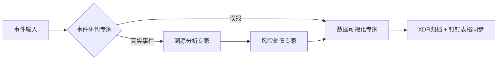

# XSOC-Agent 智能安全运营智能体系统
## 【开发规范权威依据：`rule.md` - VEADK官方开发指南，本项目所有开发严格遵循此规范】
---
基于火山引擎VEADK智能体框架开发的安全运营多智能体系统，实现安全事件的自动化研判、溯源、处置和归档全流程闭环，替代人工完成80%以上的常规安全运营工作。
## 🌟 核心功能
### 🤖 四大安全专家智能体
| 智能体 | 职责 |
|--------|------|
| **事件研判专家** | 统一接收XDR API推送和Web人工输入的安全事件，综合多源数据研判事件真实性，区分误报和真实攻击 |
| **溯源分析专家** | 对真实攻击事件进行深度调查，还原完整攻击路径，生成溯源报告 |
| **风险处置专家** | 根据溯源结果生成最小影响处置策略，自动化执行IP封禁、终端隔离等操作 |
| **数据可视化专家** | 生成标准化事件报告，完成XDR系统归档和钉钉AI表格数据同步 |
### 🛠️ 内置安全工具集
- 资产信息查询（服务器/办公终端资产信息查询）
- 攻击源威胁情报查询（IP/域名/哈希恶意性判定）
- 事件信息查询（事件详情查询、举证信息查询、进程实体查询）
- 告警及风险信息查询（告警详情查询、风险资产查询、风险标签查询）
- 处置操作（告警状态更新、IP封禁操作、白名单管理）
- 数据归档（事件归档回写、钉钉AI表格数据同步）
### 🎯 VEADK原生能力开箱即用
- ✅ 自带Web管理面板，支持智能体调试、监控、日志查看
- ✅ 自带API文档和调试界面
- ✅ 内置可观测性、调用链追踪、Metrics指标
- ✅ 自动多模型支持、工具调用、上下文管理
- ✅ 完善的权限控制和审计能力
## 🚀 快速开始
### 环境要求
- Python 3.10+
- VEADK >= 0.1.0
### 安装依赖
```bash
# 创建虚拟环境
python -m venv venv
source venv/bin/activate  # Windows: venv\Scripts\activate
# 安装依赖
pip install -e .[dev]
```
### 配置环境变量
```bash
cp .env.example .env
# 编辑.env文件，填入LLM密钥和各类API配置
```
### 启动服务
```bash
python main.py
```
### 访问地址
- 🔧 VEADK管理面板：http://localhost:8888
- 📚 API文档：http://localhost:8888/docs
- 📊 监控面板：http://localhost:8888/monitor
## 📁 项目结构（VEADK官方标准）
```
xsoc-agent/
├── main.py              # 项目入口（仅3行代码）
├── veadk.yaml           # VEADK全局配置文件
├── .env                 # 环境变量配置
├── pyproject.toml       # 项目依赖
├── Dockerfile           # 容器化部署配置
├── rule.md              # ✅ VEADK官方开发指南（开发规范权威依据）
├── study_note.md        # 项目学习笔记
├── xsoc_blueprint.mermaid # 项目架构蓝图
├── todo.md              # 开发计划
├── README.md            # 项目说明文档
├── agents/              # 智能体业务实现
│   ├── investigation_agent.py  # 事件研判专家
│   ├── tracing_agent.py        # 溯源分析专家
│   ├── response_agent.py       # 风险处置专家
│   └── visualization_agent.py  # 数据可视化专家
├── tools/               # 安全工具集业务实现
│   ├── threat_intel_tool.py    # 威胁情报查询工具
│   ├── xdr_api_tools.py        # XDR API工具集
│   ├── asset_query_tool.py     # 资产查询工具
│   ├── ndr_edr_tools.py        # NDR/EDR工具集
│   └── dingtalk_tools.py       # 钉钉工具集
├── flows/               # 智能体协作流程定义
├── schemas/             # 数据模型定义
│   └── security_event.py      # 标准化安全事件Schema
└── tests/               # 业务代码测试
```
## 🔄 事件处理流程

## 📝 开发规范
1. **所有开发必须严格遵循 `rule.md` 中的VEADK官方开发规范**
2. 智能体继承 `veadk.Agent` 基类，仅需实现业务逻辑，禁止重复开发底层能力
3. 工具继承 `veadk.BaseTool` 基类，自动注册、自动参数校验
4. 代码风格遵循PEP 8，使用black、isort格式化
5. 所有业务数据模型使用Pydantic定义，保证类型安全
## 📄 相关文档
- 📌 [VEADK开发规范](./rule.md) （权威依据）
- [项目架构蓝图](./xsoc_blueprint.mermaid)
- [开发计划](./todo.md)
## 许可证
MIT
