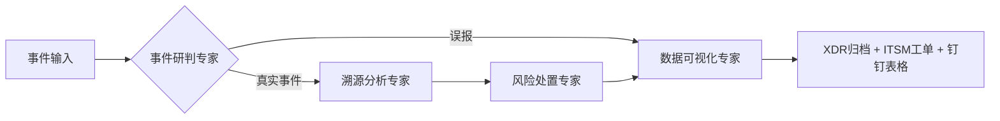

# XSOC-Agent 智能安全运营智能体系统
## 【开发规范权威依据：`rule.md` - VEADK官方开发指南，本项目所有开发严格遵循此规范】
---
基于火山引擎VEADK智能体框架开发的安全运营多智能体系统，实现安全事件的自动化研判、溯源、处置和归档全流程闭环，替代人工完成80%以上的常规安全运营工作。
## 🌟 核心功能
### 🎯 编排智能体（核心调度）
| 智能体 | 职责 |
|--------|------|
| **SecurityEventOrchestrator** | 作为核心调度智能体，接收安全告警，协调四个专家智能体完成全流程闭环处理 |

**父子智能体架构**：编排智能体通过`sub_agents`注册四个子智能体，实现：
- 接收用户输入（JSON告警数据）
- 根据研判结果智能调度（误报→归档，真实攻击→溯源→处置→归档）
- 异常处理和人工审核支持

### 🤖 四大专家智能体（子智能体）
| 智能体 | 职责 |
|--------|------|
| **InvestigationAgent** | 事件研判专家：综合多源数据研判事件真实性，区分误报和真实攻击 |
| **TracingAgent** | 溯源分析专家：还原完整攻击路径，提取攻击线索，生成溯源报告 |
| **ResponseAgent** | 风险处置专家：生成最小影响处置策略，执行IP封禁、终端隔离等操作 |
| **VisualizationAgent** | 数据可视化专家：生成标准化事件报告，完成XDR归档和钉钉数据同步 |
### 🛠️ 内置安全工具集（异步支持）
- 资产信息查询（服务器/办公终端资产信息查询）- 异步调用支持
- 攻击源威胁情报查询（IP/域名/哈希恶意性判定）- 异步调用支持
- 事件信息查询（事件详情查询、举证信息查询、进程实体查询）- 异步调用支持
- 告警及风险信息查询（告警详情查询、风险资产查询、风险标签查询）- 异步调用支持
- 处置操作（告警状态更新、IP封禁操作、白名单管理）- 异步调用支持
- 数据归档（事件归档回写、钉钉AI表格数据同步）- 异步调用支持
### 🎯 VEADK原生能力开箱即用
- ✅ 自带Web管理面板，支持智能体调试、监控、日志查看
- ✅ 自带API文档和调试界面
- ✅ 内置可观测性、调用链追踪、Metrics指标
- ✅ 自动多模型支持、工具调用、上下文管理
- ✅ 完善的权限控制和审计能力
## 🚀 快速开始
### 环境要求
- Python 3.10+
- VEADK >= 0.1.0
### 安装依赖
```bash
# 创建虚拟环境
python -m venv venv
source venv/bin/activate  # Windows: venv\Scripts\activate
# 安装依赖
pip install -e .[dev]
```
### 配置环境变量
```bash
cp .env.example .env
# 编辑.env文件，填入LLM密钥和各类API配置
```
### 启动服务

```bash
veadk web
```

或使用自定义端口：
```bash
veadk web --port 8888
```

或外部访问：
```bash
veadk web --host 0.0.0.0 --port 8000
```

### 使用Web UI

启动后访问 http://localhost:8000，在智能体选择下拉列表中选择 **flows** 作为编排智能体。

**重要说明**：
- Web UI通过扫描项目子目录发现智能体
- `flows/`目录包含编排智能体（SecurityEventOrchestrator）
- 选择"flows"后，编排智能体将协调所有子智能体处理安全事件
- 直接发送JSON格式的告警数据，编排智能体会自动调度处理流程

### 访问地址

- 🔧 VEADK管理面板：http://localhost:8000
- 📚 API文档：http://localhost:8000/docs
- 📊 监控面板：http://localhost:8000/monitor

**注意**：默认端口为8000，可通过 `--port` 参数修改
## 📁 项目结构（VEADK官方标准）
```
xsoc-agent/
├── agent.py              # 包入口，导出root_agent
├── __init__.py           # Python包定义
├── main.py               # 项目启动入口（仅3行代码）
├── .env                  # 环境变量配置
├── .env.example          # 环境变量模板
├── pyproject.toml        # 项目依赖
├── Dockerfile            # 容器化部署配置
├── rule.md               # ✅ VEADK官方开发指南（开发规范权威依据）
├── xsoc_blueprint.mermaid # 项目架构蓝图
├── todo.md               # 开发计划
├── problems.md           # 待解决问题记录
├── NOTES.md              # 重要发现和Issue记录
├── README.md             # 项目说明文档
├── flows/                # 智能体协作流程定义
│   ├── __init__.py       # 导出root_agent供ve web发现
│   ├── flow_plan.md      # 流程规划详细文档
│   └── security_event_flow.py  # 编排智能体（核心调度）
├── agents/               # 专家智能体业务实现
│   ├── investigation_agent.py  # 事件研判专家
│   ├── tracing_agent.py        # 溯源分析专家
│   ├── response_agent.py       # 风险处置专家
│   └── visualization_agent.py  # 数据可视化专家
├── tools/                # 安全工具集业务实现
│   ├── asset_query_tool.py       # 资产信息查询工具
│   ├── threat_intel_tool.py      # 攻击源威胁情报查询工具
│   ├── event_query_tool.py       # 事件信息查询工具
│   ├── alert_risk_query_tool.py  # 告警及风险信息查询工具
│   ├── response_tool.py          # 处置操作工具
│   └── data_archive_tool.py      # 数据归档工具
├── schemas/              # 数据模型定义
│   └── security_event.py      # 标准化安全事件Schema
└── tests/                # 业务代码测试
    ├── unit/             # 单元测试
    ├── integration/      # 集成测试
    └── e2e/              # 端到端测试
```
## 🔄 事件处理流程


## 🛠️ 系统API意图分类（六大主工具）

### 1. 资产信息查询工具
- **功能**：查询服务器/办公终端资产信息
- **覆盖平台**：XDR、NDR、Corplink

### 2. 攻击源威胁情报查询工具
- **功能**：查询IP/域名/哈希的恶意性判定
- **覆盖平台**：XDR、NDR、微步在线

### 3. 事件信息查询工具
- **功能**：查询事件详情、举证信息、进程实体
- **覆盖平台**：XDR、NDR、EDR

### 4. 告警及风险信息查询工具
- **功能**：查询告警详情、风险资产、风险标签
- **覆盖平台**：XDR、NDR、EDR

### 5. 处置操作工具
- **功能**：执行IP封禁、白名单管理、终端隔离、告警状态更新
- **覆盖平台**：XDR、NDR、EDR

### 6. 数据归档工具
- **功能**：事件归档回写、钉钉AI表格数据同步、ITSM工单发起
- **覆盖平台**：XDR、钉钉、ITSM
## 📝 开发规范
1. **所有开发必须严格遵循 `rule.md` 中的VEADK官方开发规范**
2. 智能体继承 `veadk.Agent` 基类，仅需实现业务逻辑，禁止重复开发底层能力
3. 工具继承 `veadk.BaseTool` 基类，自动注册、自动参数校验
4. 代码风格遵循PEP 8，使用black、isort格式化
5. 所有业务数据模型使用Pydantic定义，保证类型安全
## 📊 开发进度

### ✅ 已完成
- **Phase 0**: 项目初始化（VEADK标准结构、依赖配置、Dockerfile）
- **Phase 1**: 专家智能体开发（研判、溯源、处置、可视化）
- **Phase 2**: 安全工具集开发（6大工具集全部完成）
- **Phase 3**: 智能体协作流程设计（编排智能体架构）
- **Phase 5.2**: Web UI服务启动与验证
- **Phase 5.3**: Web UI智能体显示问题（Issue已提交）
- **Phase 5.4**: 编排智能体输入处理（"[Empty]"问题已解决）

### 🚧 进行中
- **Phase 5.4**: 智能体流程串联（研判完成后后续智能体调用）

### 📋 待解决
- 事件状态可视化（智能体回复需附加状态机和数据结构）

详细进度见 [todo.md](./todo.md)，待解决问题见 [problems.md](./problems.md)

---

## 📄 相关文档
- 📌 [VEADK开发规范](./rule.md) （权威依据）
- [项目架构蓝图](./xsoc_blueprint.mermaid)
- [智能体流程规划](./flows/flow_plan.md)
- [开发计划](./todo.md)
- [待解决问题](./problems.md)
- [重要发现和Issue](./NOTES.md)
## 许可证
MIT
