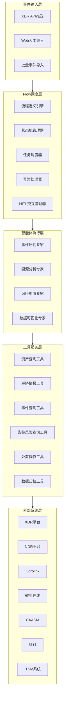
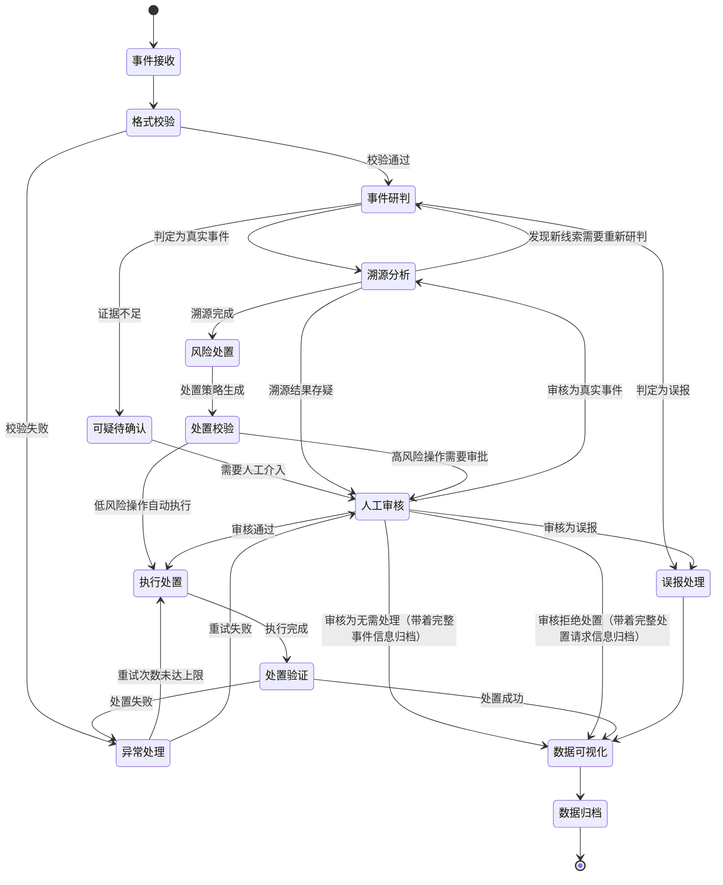

# Phase3 AgentFlows 智能体协作流程规划
## 基于VEADK框架的安全运营全流程闭环设计
---

## 📋 理解与概述
### 核心设计思路
AgentFlows是XSOC智能安全运营系统的核心调度层，基于VEADK框架的原生Workflow能力，实现四大专家智能体的自动化协作、事件状态全链路管理、异常处理和人工干预机制，最终完成安全事件从接收、研判、溯源、处置到归档的全流程自动化闭环。

### 设计目标
1. **流程标准化**：将现有线性处理流程固化为可编排、可监控的工作流
2. **状态可追溯**：实现事件全生命周期状态管理，每一步操作都可审计
3. **异常自修复**：内置错误重试、回滚和降级机制，提高系统鲁棒性
4. **人工干预友好**：支持流程暂停、人工审核、流程回退等HITL(人机交互)能力
5. **高并发支持**：基于VEADK异步能力，支持多事件并行处理

---

## 🏗️ 架构设计
### 总体分层架构


### 核心流程定义
#### 主流程：安全事件全链路处理


---

## 🎯 架构选型对比与最终选择
### 四种智能体编排结构深度对比
本项目有四种可选的智能体编排实现方式，经过综合评估，最终选择**父子智能体模式**作为核心架构，对比分析如下：

| 对比维度           | 配置型Workflow模式           | 父子智能体模式             | 独立流程编排器模式           | 直接顺序调用模式         | 本项目选择   |
|--------------------|----------------------------|---------------------------|-----------------------------|------------------------|-------------|
| 开发成本           | 高（需学习Workflow DSL）     | 低（基于VEADK基础API）     | 中（需自行实现通用能 力）     | 极低（直接调用即可）     | ✅ 父子智能体 |
| 现有代码兼容性     | 低（需改造现有智能体）        | 极高（零侵入现有逻辑）       | 中（需统一返回格式）         | 极高（无需任何改造       | ✅ 父子智能体 |
| 调试可维护性       | 低（框架黑盒）               | 极高（纯代码逻辑可断点调试） | 中（自主实现逻辑多）          | 高（逻辑简单直观）       | ✅ 父子智能体 |
| 框架依赖度         | 极高（完全绑定Workflow）     | 中（依赖基础智能体能力）     | 极低（完全独立）             | 极低（无额外依赖）       | ✅ 父子智能体 |
| 复杂场景支持       | 中（复杂逻辑实现受限）       | 高（Python代码灵活实现）     | 极高（完全自主控制）         | 低（循环、回退需手动处理） | ✅ 父子智能体 |
| 风险与稳定性       | 高（新特性未经验证）         | 极低（基础能力久经考验）     | 中（自研逻辑易出bug）        | 低（无统一异常处理）      | ✅ 父子智能体 |
| 可观测性支持       | 高（框架自带）               | 高（智能体原生支持）        | 低（需自行实现）             | 低（日志分散难追踪）      | ✅ 父子智能体 |
| HITL人机交互       | 高（框架自带）               | 高（智能体原生支持）        | 低（需自行实现）             | 低（每处调用点需单独处理  | ✅ 父子智能体 |
| 跨阶段回滚         | 高（框架支持）               | 高（父智能体统一管理）      | 中（需自行实现）             | 低（各智能体无法跨阶段回滚 | ✅ 父子智能体 |
| 全局状态管理       | 高（框架自带）               | 高（状态机统一管理）        | 中（需自行实现）             | 低（状态分散在各智能体）   | ✅ 父子智能体 |
| 开发周期匹配度     | 差（无法保证3天工期）        | 极好（3天可完成核心开发）    | 一般（自研逻辑耗时长）       | 极好（最快实现方式）       | ✅ 父子智能体 |

### 最终架构决策
**采用融合方案：以父子智能体模式为核心架构，吸收Workflow模式的优秀设计思想：**
1. ✅ 基础架构：基于VEADK原生`sub_agents`能力，实现`SecurityEventOrchestrator`协调父智能体作为调度核心
2. ✅ 流程设计：保留原Workflow方案的全链路闭环设计，所有事件路径最终进入归档流程，无信息丢失
3. ✅ 状态管理：融合两份方案的状态定义，实现12种覆盖全场景的事件状态
4. ✅ 异常处理：保留重试、熔断、回滚、降级等完整的异常处理机制
5. ✅ 人工干预：支持暂停、确认、修改、回退、关闭等丰富的人机交互能力

---

## 📝 详细设计规范
### 1. 流程定义规范
基于VEADK父子智能体模式实现，所有流程定义遵循以下规范：

#### 1.1 基础结构
```python
from veadk import Agent
from agents import (
    InvestigationAgent,
    TracingAgent,
    ResponseAgent,
    VisualizationAgent
)

class SecurityEventOrchestrator(Agent):
    """安全事件协调父智能体 - 流程调度核心"""
    name = "security_orchestrator"
    display_name = "安全事件协调器"
    description = "协调调度四大专家智能体处理安全事件，实现全流程自动化闭环"

    def __init__(self, **kwargs):
        # 注册子智能体
        kwargs["sub_agents"] = [
            InvestigationAgent(),
            TracingAgent(),
            ResponseAgent(),
            VisualizationAgent()
        ]
        super().__init__(**kwargs)

        # 初始化状态机、重试计数器、熔断管理器
        self.state_machine = EventStateMachine()
        self.retry_count = {}
        self.circuit_breaker = {}
```

#### 1.2 主流程实现
流程逻辑写在父智能体的run方法中，使用异步调用子智能体：
```python
async def run(self, event_data: Dict[str, Any]) -> Dict[str, Any]:
    """智能体执行入口 - 主流程控制"""
    event_id = self._extract_event_id(event_data)

    try:
        # ========== Step 1: 事件研判 ==========
        self.state_machine.transition(event_id, EventState.INVESTIGATING, "开始研判")
        investigate_result = await self._execute_with_retry(
            "investigation_agent", event_data, event_id
        )

        # 分支处理
        if investigate_result["result"] == "误报":
            return await self._handle_false_positive(event_id, investigate_result)
        elif investigate_result["result"] == "可疑待确认":
            return await self._handle_need_human(event_id, investigate_result, "investigation")

        # ========== Step 2: 溯源分析 ==========
        self.state_machine.transition(event_id, EventState.TRACING, "研判完成，开始溯源")
        tracing_result = await self._execute_with_retry(
            "tracing_agent", investigate_result, event_id
        )

        # 循环溯源逻辑
        if tracing_result.get("need_reinvestigation"):
            self.logger.info(f"溯源发现新线索，回退研判阶段: {event_id}")
            return await self.run({**event_data, "new_evidence": tracing_result["new_evidence"]})

        # ========== Step 3: 风险处置 ==========
        self.state_machine.transition(event_id, EventState.RESPONDING, "溯源完成，开始处置")

        # 高风险操作人工审核
        if self._is_high_risk(tracing_result):
            return await self._handle_need_human(event_id, tracing_result, "response")

        response_result = await self._execute_with_retry(
            "response_agent", tracing_result, event_id
        )

        # ========== Step 4: 数据可视化与归档 ==========
        return await self._handle_archive(event_id, response_result)

    except Exception as e:
        self.state_machine.transition(event_id, EventState.FAILED, str(e))
        return {"status": "failed", "event_id": event_id, "error": str(e)}
```

### 2. 状态机设计
#### 2.1 事件状态定义

| 状态码                | 状态名称     | 描述                                  |
|-----------------------|-------------|--------------------------------------|
| `PENDING`             | 待处理       | 事件刚接收，等待调度                   |
| `VALIDATING`          | 格式校验中   | 正在进行事件格式校验和字段补全          |
| `INVESTIGATING`       | 研判中       | 事件研判专家正在处理                   |
| `FALSE_POSITIVE`      | 误报         | 判定为误报，等待归档                   |
| `TRACING`             | 溯源中       | 溯源分析专家正在处理                   |
| `PROCESSING`          | 处置中       | 风险处置专家正在生成策略和执行操作      |
| `VALIDATING_DISPOSAL` | 处置校验中   | 正在进行处置操作安全校验                |
| `PENDING_APPROVAL`    | 待人工审核   | 高风险操作等待人工审批                  |
| `EXECUTING_DISPOSAL`  | 处置执行中   | 正在执行处置操作                       |
| `VERIFYING_DISPOSAL`  | 处置验证中   | 正在验证处置操作效果                    |
| `VISUALIZING`         | 报告生成中   | 数据可视化专家正在生成报告              |
| `ARCHIVING`           | 归档中       | 正在执行多平台数据归档                  |
| `COMPLETED`           | 已完成       | 事件全流程处理完成                     |
| `FAILED`              | 处理失败     | 流程异常终止                           |
| `CLOSED`              | 已关闭       | 人工关闭事件，将进入归档流程            |

#### 2.2 状态流转规则
- 状态只能向前流转或回退到上一个节点，禁止跳级流转
- 异常状态必须触发通知机制
- 所有状态变更必须记录操作日志和操作人信息

### 3. 异常处理机制
#### 3.1 重试机制
- **指数退避重试**：失败后间隔1s、2s、4s、8s重试，最多3次
- **可重试错误类型**：网络超时、外部接口限流、临时服务不可用
- **不可重试错误类型**：参数错误、权限不足、数据不存在

#### 3.2 降级机制
- 工具调用失败时，自动降级使用备选平台接口
- 智能体处理超时，自动触发人工干预流程
- 系统负载过高时，自动限制并发处理数量

#### 3.3 回滚机制
- 处置操作失败时，自动执行回滚操作，恢复到处置前状态
- 流程中断时，自动回滚已执行的变更操作

### 4. 熔断保护规则
```python
# 熔断配置
circuit_breaker = {
    "failure_threshold": 5,  # 5次失败触发熔断
    "recovery_timeout": 60,  # 熔断60秒后尝试恢复
    "sliding_window_size": 60,  # 统计窗口60秒
    "minimum_calls": 10,  # 最少调用10次才触发熔断判断
}
```

熔断触发场景：
1. 外部接口调用失败率超过80%
2. 智能体处理错误率超过50%
3. 系统响应时间超过阈值(>30s)

### 5. 人工干预流程
#### 5.1 触发场景
- 事件研判结果为"可疑待确认"
- 高风险处置操作(如核心资产隔离、批量IP封禁)
- 流程处理失败超过重试次数
- 溯源结果存疑需要人工确认
- 用户主动发起干预请求

#### 5.2 干预能力
- **流程暂停**：暂停当前流程，等待人工处理
- **结果确认**：确认智能体处理结果，继续流程
- **结果修改**：修改智能体处理结果，继续流程
- **流程回退**：回退到上一个节点重新处理
- **流程关闭**：直接关闭事件，终止流程
- **重新调度**：重新分配智能体处理当前节点

---

## 🚀 实施规划
### 开发计划(3天)

| 时间  | 任务                     | 输出                                                                                      |
|-------|--------------------------|-------------------------------------------------------------------------------------------|
| Day1  | 协调智能体基础框架开发   | 1. SecurityEventOrchestrator父智能体实现<br>2. 事件状态机与状态流转规则实现<br>3. 主流程控制逻辑实现 |
| Day2  | 异常处理和人工干预实现   | 1. 重试/熔断/回滚/降级机制实现<br>2. 人工审核/干预接口实现<br>3. 统一归档入口实现         |
| Day3  | 集成测试与优化           | 1. 与现有四大智能体联调<br>2. 全场景单元测试与异常场景测试<br>3. 性能优化与文档完善        |

### 关键文件结构
```
flows/
├── __init__.py
├── flow_plan_claudecode.md # 本规划文档
├── think_claudecode.md     # 架构选型思考文档
├── security_event_flow.py  # 主流程定义（协调智能体+状态机+入口函数）
└── tests/                  # 流程测试用例
```

### 集成方式
1. 在main.py中注册根智能体
```python
from veadk import Runner
from flows.security_event_flow import root_agent

runner = Runner(root_agent=root_agent)

if __name__ == "__main__":
    runner.run()
```

2. 事件通过API触发流程
```python
# API调用示例
POST /api/agent/security_orchestrator/run
{
    "input": {
        "event_id": "xxx",
        "event_type": "malware_attack",
        "asset_ip": "1.2.3.4",
        "severity": "high",
        ...
    }
}
```

---

## ✅ 验收标准
1. **功能验收**
   - 支持安全事件全流程自动化处理
   - 支持所有状态流转和异常处理场景
   - 支持人工干预的所有能力
   - 与现有智能体和工具集无缝集成

2. **性能验收**
   - 单事件平均流程调度耗时<1s
   - 支持同时处理至少100个并行事件
   - 异常处理成功率>95%

3. **可用性验收**
   - 流程处理全链路可监控、可追踪
   - 操作日志完整可审计
   - 错误提示清晰，便于问题定位